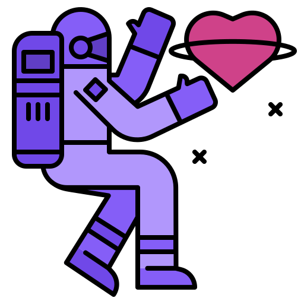
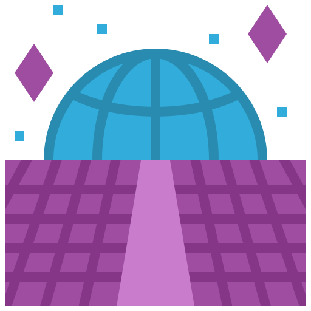

  <b><i>"The net is vast and infinite."</i></b>

<!-- ABOUT ME -->
## 🙋‍♂️ About Me

-  I'm **Daniel Macedo**, currently a **Developer in Progress**.  
-  Main technologies: **Java, Spring Boot, SQL, and APIs**.  
-  Currently learning **Spring Boot, Hibernate, and Software Architecture**.  
-  Ask me about: **Tech, Games, or Anime**.  
-  Genre: **Cyberpunk lover**

<!-- GITHUB STATS -->
## 🚀 GitHub Overview & Tech Stack

  
  

 
<!-- TECH STACK ICONS -->

  
  
  
  
  
  

<!-- CONTACT -->
## 📬 Contact

  
  
  

<!-- PACMAN CONTRIBUTION GRAPH -->
<picture>
  <source media="(prefers-color-scheme: dark)" srcset="https://raw.githubusercontent.com/Daniel-Macedo-dev/Daniel-Macedo-dev/output/pacman-contribution-graph-dark.svg">
  <source media="(prefers-color-scheme: light)" srcset="https://raw.githubusercontent.com/Daniel-Macedo-dev/Daniel-Macedo-dev/output/pacman-contribution-graph.svg">
  
</picture>
