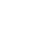

  

  <b><i>"The net is vast and infinite."</i></b>

 

<!-- ABOUT ME -->
<h2 align="center">About Me</h2>

   I'm <b>Daniel Macedo</b>, currently a <b>Developer in Progress</b>.

   Main technologies: <b>Java, SQL, NoSQL, Spring Boot and APIs</b>.

   Currently learning <b>Spring Boot, Hibernate, and Software Architecture</b>.

   Ask me about: <b>Tech, Games, or Anime</b>.

 

<!-- GITHUB STATS -->
<h2 align="center">GitHub Overview & Tech Stack</h2>

  
  

 

  

 

<!-- TECHNOLOGIES -->
<h2 align="center">Technologies</h2>

  
  
  
  
  
  
   
  
  
  

 

<!-- CONTACT -->
<h2 align="center">Contact</h2>

  
  
  

 

<!-- PACMAN CONTRIBUTION GRAPH -->
<h2 align="center">Contribution Graph</h2>

  <picture>
    <source media="(prefers-color-scheme: dark)" srcset="https://raw.githubusercontent.com/Daniel-Macedo-dev/Daniel-Macedo-dev/output/pacman-contribution-graph-dark.svg">
    <source media="(prefers-color-scheme: light)" srcset="https://raw.githubusercontent.com/Daniel-Macedo-dev/Daniel-Macedo-dev/output/pacman-contribution-graph.svg">
    
  </picture>

 

If you like it, do fork 🍴 and star ⭐

